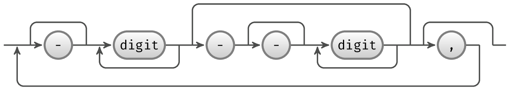
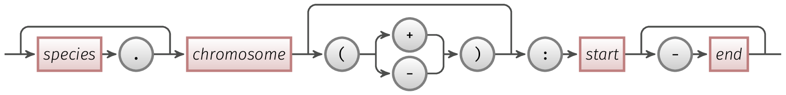

# intspan

[](https://github.com/wang-q/intspan/actions)
[](https://github.com/wang-q/intspan/actions)
[](https://ci.appveyor.com/project/wang-q/intspan)
[](https://codecov.io/github/wang-q/intspan?branch=master)
[](https://crates.io/crates/intspan)
[](https://github.com//wang-q/intspan)

## Install

Current release: 0.6.7

```bash
cargo install intspan

cargo install --force --path .

# or
brew install intspan

```

## SYNOPSIS

* `spanr`

```text
$ spanr help
spanr 0.6.7
wang-q <wang-q@outlook.com>
`spanr` operates chromosome IntSpan files

USAGE:
    spanr [SUBCOMMAND]

OPTIONS:
    -h, --help       Print help information
    -V, --version    Print version information

SUBCOMMANDS:
    combine     Combine multiple sets of runlists in a yaml file
    compare     Compare 1 YAML file against others
    convert     Convert runlist file to ranges file
    count       Count each range overlapping with other range files
    cover       Output covers on chromosomes
    coverage    Output minimum or detailed depth of coverage on chromosomes
    genome      Convert chr.size to runlists
    gff         Convert gff3 to covers on chromosomes
    help        Print this message or the help of the given subcommand(s)
    merge       Merge runlist yaml files
    range       Compare runlist file with range file
    some        Extract some records from a runlist yaml file
    span        Operate spans in a YAML file
    split       Split a runlist yaml file
    stat        Coverage on chromosomes for runlists
    statop      Coverage on chromosomes for one YAML crossed another

```

* `linkr`

```text
$ linkr help
linkr 0.6.1
wang-q <wang-q@outlook.com>
`linkr` operates ranges on chromosomes and links of ranges

USAGE:
    linkr [SUBCOMMAND]

OPTIONS:
    -h, --help       Print help information
    -V, --version    Print version information

SUBCOMMANDS:
    circos     Convert links to circos links or highlights
    clean      Replace ranges within links, incorporate hit strands and remove nested links
    connect    Connect bilateral links into multilateral ones
    filter     Filter links by numbers of ranges or length differences
    help       Print this message or the help of the given subcommand(s)
    merge      Merge overlapped ranges via overlapping graph
    sort       Sort links and ranges within links

```

* `ovlpr`

```text
$ ovlpr help
ovlpr 0.6.1
wang-q <wang-q@outlook.com>
`ovlpr` operates overlaps between sequences

USAGE:
    ovlpr [SUBCOMMAND]

OPTIONS:
    -h, --help       Print help information
    -V, --version    Print version information

SUBCOMMANDS:
    covered     Covered regions from .ovlp.tsv files
    help        Print this message or the help of the given subcommand(s)
    paf2ovlp    Convert minimap .paf to overlaps
    replace     Replace fields in *.tsv
    restrict    Restrict overlaps to known pairs

```

## Concepts

### IntSpans

An IntSpan represents sets of integers as a number of inclusive ranges, for example `1-10,19,45-48`.

The following figure shows the schema of an IntSpan object. Jump lines are above the baseline; loop
lines are below it.



Also, [AlignDB::IntSpan](https://github.com/wang-q/AlignDB-IntSpan) and
[jintspan](https://github.com/egateam/jintspan) are implements of the IntSpan objects in Perl and
Java, respectively.

### IntSpans on chromosomes

* Single: [`repeat.yml`](tests/spanr/repeat.yml)

* Multi: [`Atha.yml`](tests/spanr/Atha.yml)

* `chr.sizes`: [`S288c.chr.sizes`](tests/spanr/S288c.chr.sizes)

### Ranges

An example is [`S288c.ranges`](tests/spanr/S288c.ranges)

```text
I:1-100
I(+):90-150
S288c.I(-):190-200
II:21294-22075
II:23537-24097

```



Simple rules:

* `chromosome` and `start` are required
* `species`, `strand` and `end` are optional
* `.` to separate `species` and `chromosome`
* `strand` is one of `+` and `-` and surround by round brackets
* `:` to separate names and digits
* `-` to separate `start` and `end`
* For `species`:
    * `species` should be alphanumeric with no spaces, the one exception character is `/`.
    * A `species` is an identity that you can also think of as a strain name, an assembly, or
      something else.

```text
species.chromosome(strand):start-end
--------^^^^^^^^^^--------^^^^^^----

```

### Links of ranges

Types of links:

* Bilateral links

        I(+):13063-17220    I(-):215091-219225
        I(+):139501-141431  XII(+):95564-97485

* Bilateral links with hit strand

        I(+):13327-17227    I(+):215084-218967  -
        I(+):139501-141431  XII(+):95564-97485  +

* Multilateral links

        II(+):186984-190356 IX(+):12652-16010   X(+):12635-15993

## EXAMPLES

### `spanr`

```bash
spanr genome tests/spanr/S288c.chr.sizes

spanr genome tests/spanr/S288c.chr.sizes |
    spanr stat tests/spanr/S288c.chr.sizes stdin --all

spanr some tests/spanr/Atha.yml tests/spanr/Atha.list

spanr merge tests/spanr/I.yml tests/spanr/II.yml

spanr cover tests/spanr/S288c.ranges
spanr cover tests/spanr/dazzname.ranges

spanr coverage tests/spanr/S288c.ranges -m 2

spanr coverage tests/spanr/S288c.ranges -d

spanr gff tests/spanr/NC_007942.gff --tag tRNA

spanr span --op cover tests/spanr/brca2.yml

spanr combine tests/spanr/Atha.yml

spanr compare \
    --op intersect \
    tests/spanr/intergenic.yml \
    tests/spanr/repeat.yml

spanr compare \
    --op intersect \
    tests/spanr/I.II.yml \
    tests/spanr/I.yml \
    tests/spanr/II.yml

spanr split tests/spanr/I.II.yml

spanr stat tests/spanr/S288c.chr.sizes tests/spanr/intergenic.yml

spanr stat tests/spanr/S288c.chr.sizes tests/spanr/I.II.yml

spanr stat tests/spanr/Atha.chr.sizes tests/spanr/Atha.yml

spanr statop \
    --op intersect \
    tests/spanr/S288c.chr.sizes \
    tests/spanr/intergenic.yml \
    tests/spanr/repeat.yml

diff <(spanr statop \
        --op intersect --all\
        tests/spanr/Atha.chr.sizes \
        tests/spanr/Atha.yml \
        tests/spanr/paralog.yml ) \
    <(jrunlist statop \
        -o stdout \
        --op intersect --all \
        tests/spanr/Atha.chr.sizes \
        tests/spanr/Atha.yml \
        tests/spanr/paralog.yml )

spanr convert tests/spanr/repeat.yml tests/spanr/intergenic.yml |
    spanr cover stdin |
    spanr stat tests/spanr/S288c.chr.sizes stdin --all

spanr merge tests/spanr/repeat.yml tests/spanr/intergenic.yml |
    spanr combine stdin |
    spanr stat tests/spanr/S288c.chr.sizes stdin --all

spanr range --op overlap tests/spanr/intergenic.yml tests/spanr/S288c.ranges

spanr count tests/spanr/S288c.ranges tests/spanr/S288c.ranges

```

### `linkr`

```bash
linkr sort tests/linkr/II.links.tsv -o tests/linkr/II.sort.tsv

linkr merge tests/linkr/II.links.tsv -v

linkr clean tests/linkr/II.sort.tsv
linkr clean tests/linkr/II.sort.tsv --bundle 500
linkr clean tests/linkr/II.sort.tsv -r tests/linkr/II.merge.tsv

linkr connect tests/linkr/II.clean.tsv -v

linkr filter tests/linkr/II.connect.tsv -n 2
linkr filter tests/linkr/II.connect.tsv -n 3 -r 0.99

linkr circos tests/linkr/II.connect.tsv
linkr circos --highlight tests/linkr/II.connect.tsv

```

Steps:

```text
        sort
          |
          v
        clean -> merge
          |     /
          |  /
          v
        clean
          |
          V
        connect
          |
          v
        filter
```

#### S288c

```bash
linkr sort tests/S288c/links.lastz.tsv tests/S288c/links.blast.tsv \
    -o tests/S288c/sort.tsv

linkr clean tests/S288c/sort.tsv \
    -o tests/S288c/sort.clean.tsv

linkr merge tests/S288c/sort.clean.tsv -c 0.95 \
    -o tests/S288c/merge.tsv

linkr clean tests/S288c/sort.clean.tsv -r tests/S288c/merge.tsv --bundle 500 \
    -o tests/S288c/clean.tsv

linkr connect tests/S288c/clean.tsv -r 0.8 \
    -o tests/S288c/connect.tsv

linkr filter tests/S288c/connect.tsv -r 0.8 \
    -o tests/S288c/filter.tsv

wc -l tests/S288c/*.tsv
#     229 tests/S288c/clean.tsv
#     148 tests/S288c/connect.tsv
#     148 tests/S288c/filter.tsv
#     566 tests/S288c/links.blast.tsv
#     346 tests/S288c/links.lastz.tsv
#      74 tests/S288c/merge.tsv
#     282 tests/S288c/sort.clean.tsv
#     626 tests/S288c/sort.tsv

cat tests/S288c/filter.tsv |
    perl -nla -F"\t" -e 'print for @F' |
    spanr cover stdin -o tests/S288c/cover.yml

spanr stat tests/S288c/chr.sizes tests/S288c/cover.yml -o stdout

```

#### Atha

```bash
gzip -dcf tests/Atha/links.lastz.tsv.gz tests/Atha/links.blast.tsv.gz | linkr sort stdin -o tests/Atha/sort.tsv

linkr clean tests/Atha/sort.tsv -o tests/Atha/sort.clean.tsv

linkr merge tests/Atha/sort.clean.tsv -c 0.95 -o tests/Atha/merge.tsv

linkr clean tests/Atha/sort.clean.tsv -r tests/Atha/merge.tsv --bundle 500 -o tests/Atha/clean.tsv

linkr connect tests/Atha/clean.tsv -o tests/Atha/connect.tsv

linkr filter tests/Atha/connect.tsv -r 0.8 -o tests/Atha/filter.tsv

wc -l tests/Atha/*.tsv
#    4500 tests/Atha/clean.tsv
#    3832 tests/Atha/connect.tsv
#    3832 tests/Atha/filter.tsv
#     785 tests/Atha/merge.tsv
#    5416 tests/Atha/sort.clean.tsv
#    7754 tests/Atha/sort.tsv

cat tests/Atha/filter.tsv |
    perl -nla -F"\t" -e 'print for @F' |
    spanr cover stdin -o tests/Atha/cover.yml

spanr stat tests/Atha/chr.sizes tests/Atha/cover.yml -o stdout

```

### `ovlpr`

```bash
echo "tests/ovlpr/1_4.anchor.fasta;tests/ovlpr/1_4.pac.fasta" |
    parallel --colsep ";" -j 1 "
        minimap2 -cx asm20 {1} {2} |
            ovlpr paf2ovlp stdin |
            tsv-sort
        minimap2 -cx asm20 {2} {1} |
            ovlpr paf2ovlp stdin |
            tsv-sort
    " |
    ovlpr covered stdin --mean

ovlpr covered tests/ovlpr/1_4.pac.paf.ovlp.tsv

ovlpr covered tests/ovlpr/11_2.long.paf --paf

ovlpr covered tests/ovlpr/1_4.pac.paf.ovlp.tsv --base

ovlpr covered tests/ovlpr/1_4.pac.paf.ovlp.tsv --mean

ovlpr paf2ovlp tests/ovlpr/1_4.pac.paf

ovlpr replace tests/ovlpr/1_4.ovlp.tsv tests/ovlpr/1_4.replace.tsv
ovlpr replace tests/ovlpr/1_4.ovlp.tsv tests/ovlpr/1_4.replace.tsv -r

ovlpr restrict tests/ovlpr/1_4.ovlp.tsv tests/ovlpr/1_4.restrict.tsv

```

## License

[](https://app.fossa.io/projects/git%2Bgithub.com%2Fwang-q%2Fintspan?ref=badge_large)
